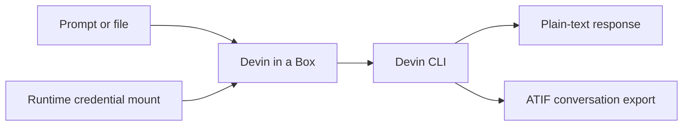

<div align="center">

# 📦 Devin in a Box

**Run Devin CLI safely and non-interactively in containers and CI pipelines.**

[](https://github.com/junior/devin-in-a-box/actions/workflows/publish.yml)
[](https://github.com/junior/devin-in-a-box/pkgs/container/devin-in-a-box)
[](https://hub.docker.com/r/junior/devin-in-a-box)
[](LICENSE)
[](https://github.com/junior/devin-in-a-box/pkgs/container/devin-in-a-box)

[Quick start](#quick-start) · [GitLab CI](#gitlab-ci) · [Model controls](#model-cost-controls) · [Firewall policy](FIREWALL.md)

</div>

Devin in a Box packages the official [Devin CLI](https://docs.devin.ai/cli)
for deterministic, non-interactive use in GitLab CI and other containerized
workflows. Give it a prompt, mount a workspace and credentials, and receive a
plain response that the next job can consume.



## Why this exists

- **CI-native:** uses Devin's `--print` mode and exits after one response.
- **Clean output:** suppresses first-run UI so stdout stays machine-readable.
- **No baked credentials:** authentication is mounted only at runtime.
- **Predictable cost:** defaults to `swe-1.6`, with an explicit model override.
- **Hardened base:** built on Docker Hardened Debian 13 (Trixie).
- **Pipeline handoff:** writes a response and optional ATIF export as artifacts.
- **Enterprise-friendly:** includes model-control and firewall guidance.

## Quick start

### 1. Authenticate once

On a trusted workstation, install Devin CLI and sign in:

```bash
devin auth login
```

The credential file is normally stored at:

```text
~/.local/share/devin/credentials.toml
```

If `XDG_DATA_HOME` is set, use
`$XDG_DATA_HOME/devin/credentials.toml` instead. Treat this file like an API
token: never commit it, copy it into an image, or expose it in job logs.

### 2. Run the published image

Choose either registry:

```bash
export DEVIN_IMAGE=ghcr.io/junior/devin-in-a-box:latest
# Or: export DEVIN_IMAGE=junior/devin-in-a-box:latest
```

Run a read-only prompt against the current repository:

```bash
docker run --rm \
  --volume "$PWD:/workspace" \
  --volume "$HOME/.local/share/devin/credentials.toml:/run/secrets/credentials.toml:ro" \
  --env DEVIN_CREDENTIALS_FILE=/run/secrets/credentials.toml \
  --env DEVIN_PERMISSION_MODE=normal \
  --env 'DEVIN_PROMPT=Review this repository and list the three highest-risk issues.' \
  "$DEVIN_IMAGE"
```

Or pipe a prompt over standard input:

```bash
printf '%s\n' 'Summarize this repository.' | docker run --rm -i \
  --volume "$PWD:/workspace" \
  --volume "$HOME/.local/share/devin/credentials.toml:/run/secrets/credentials.toml:ro" \
  --env DEVIN_CREDENTIALS_FILE=/run/secrets/credentials.toml \
  "$DEVIN_IMAGE"
```

## Inputs and outputs

| Variable | Required | Default | Description |
| --- | --- | --- | --- |
| `DEVIN_CREDENTIALS_FILE` | Yes* | — | Mounted path to `credentials.toml`. *May be omitted when credentials already exist in Devin's data directory. |
| `DEVIN_PROMPT` | Yes* | — | Inline prompt. *Alternatively use `DEVIN_PROMPT_FILE` or stdin. |
| `DEVIN_PROMPT_FILE` | No | — | Path to a mounted prompt file. |
| `DEVIN_MODEL` | No | `swe-1.6` | Model passed explicitly to Devin CLI. |
| `DEVIN_PERMISSION_MODE` | No | Devin default | `normal`, `auto`, `accept-edits`, `smart`, `dangerous`, `yolo`, or `bypass`. |
| `DEVIN_OUTPUT_FILE` | No | stdout | Also write the final response to this path. |
| `DEVIN_EXPORT_FILE` | No | — | Write the conversation in ATIF format after each turn. |

Input precedence is `DEVIN_PROMPT_FILE`, then `DEVIN_PROMPT`, then stdin.

## GitLab CI

The included [.gitlab-ci.yml](.gitlab-ci.yml) demonstrates the full flow:

1. Build the image from Docker Hardened Images.
2. Run a prompt against the checked-out repository.
3. Save `devin-output.txt` and `devin-conversation.json` as artifacts.
4. Download and consume those artifacts in the next job.

Configure these GitLab CI/CD variables:

| Variable | Type | Protection | Purpose |
| --- | --- | --- | --- |
| `DEVIN_CREDENTIALS_FILE` | File | Protected; masked if supported | Complete Devin `credentials.toml`. |
| `DHI_USERNAME` | Variable | Protected and masked | Docker ID permitted to pull from `dhi.io`. |
| `DHI_PASSWORD` | Variable | Protected and masked | Scoped Docker access token. |
| `DEVIN_PROMPT` | Variable | As appropriate | Prompt for the job. |
| `DEVIN_MODEL` | Variable | As appropriate | Optional model override. |

The sample uses Docker-in-Docker, so the GitLab runner must permit privileged
services. In production, consider building and scanning the image separately,
publishing it to an approved internal registry, and letting execution jobs pull
that immutable image.

## Model cost controls

The image defaults to `swe-1.6`, but `DEVIN_MODEL` makes planned migrations
possible when your Enterprise agreement changes. The environment variable is
operational configuration—not a security boundary.

For actual enforcement, use **Settings → Enterprise → Windsurf → Devin CLI
settings** and:

1. allowlist only the model included in your agreement;
2. set that same model as the team default; and
3. keep `DEVIN_MODEL` aligned with the allowlist.

The allowlist is enforced server-side. A default alone does not prevent users
from switching to another allowed model. See [Devin model
documentation](https://docs.devin.ai/cli/models) and [Enterprise Team
Settings](https://docs.devin.ai/cli/enterprise/team-settings).

## Permission modes

Start with `normal` for analysis. `accept-edits` automatically approves
workspace edits. Fully unattended commands may require `dangerous`, `yolo`, or
`bypass`; these modes approve all actions and should run only in isolated,
ephemeral runners with narrowly scoped credentials and no production secrets.

The container can access everything you mount and every environment variable
you pass. Keep mounts narrow and inject only the secrets the job truly needs.

## Build from source

The default base is `dhi.io/debian-base:trixie-dev`, which requires Docker
Hardened Images access:

```bash
docker login dhi.io
docker build --tag devin-in-a-box:local .
```

To use an approved internal mirror:

```bash
docker build \
  --build-arg BASE_IMAGE=registry.example.com/approved/debian-base:trixie-dev \
  --tag devin-in-a-box:local .
```

The Dockerfile uses Devin's latest-version installer. For a controlled
production rollout, mirror and checksum an approved installer/binary version in
your artifact registry.

## Network policy

See [FIREWALL.md](FIREWALL.md) for the build-time, runtime, enterprise, and
task-dependent outbound destinations.

## Publishing

The GitHub Actions workflow publishes multi-platform images to:

- `ghcr.io/junior/devin-in-a-box`
- `docker.io/junior/devin-in-a-box`

Tagged releases such as `v0.1.0` produce semantic-version tags and provenance.
Repository maintainers must configure `DHI_USERNAME`, `DHI_PASSWORD`,
`DOCKERHUB_USERNAME`, and `DOCKERHUB_TOKEN` as GitHub Actions secrets.

## Security

Read [SECURITY.md](SECURITY.md) before reporting a vulnerability. Never attach
Devin credentials, CI variables, or private repository contents to a public
issue.

## License

Project-authored files are released under the [MIT License](LICENSE). The
container includes third-party software under its respective licenses; see
[THIRD_PARTY_NOTICES.md](THIRD_PARTY_NOTICES.md).

## Official references

- [Devin CLI quickstart](https://docs.devin.ai/cli)
- [Commands and flags](https://docs.devin.ai/cli/reference/commands)
- [Devin authentication](https://docs.devin.ai/cli/enterprise/devin-auth)
- [Docker Hardened Debian Base](https://hub.docker.com/hardened-images/catalog/dhi/debian-base)
- [Docker Hardened Image build guidance](https://docs.docker.com/dhi/how-to/build/)
