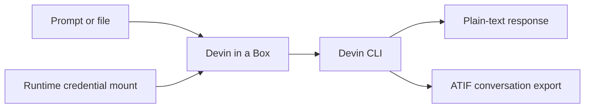

<div align="center">

# 📦 Devin in a Box

**Run Devin CLI safely and non-interactively in containers and CI pipelines.**

[](https://github.com/junior/devin-in-a-box/actions/workflows/publish.yml)
[](https://github.com/junior/devin-in-a-box/pkgs/container/devin-in-a-box)
[](https://hub.docker.com/r/junior/devin-in-a-box)
[](LICENSE)
[](https://github.com/junior/devin-in-a-box/pkgs/container/devin-in-a-box)

[Quick start](#quick-start) · [Docker Sandboxes](#docker-sandboxes) · [GitLab CI](#gitlab-ci) · [Model controls](#model-cost-controls) · [Firewall policy](FIREWALL.md)

</div>

Devin in a Box packages the official [Devin CLI](https://docs.devin.ai/cli)
for deterministic, non-interactive use in GitLab CI and other containerized
workflows. Give it a prompt, mount a workspace and credentials, and receive a
plain response that the next job can consume.



## Why this exists

- **CI-native:** uses Devin's `--print` mode and exits after one response.
- **Clean output:** suppresses first-run UI so stdout stays machine-readable.
- **No baked credentials:** authentication is mounted only at runtime.
- **Predictable cost:** defaults to `swe-1.6`, with an explicit model override.
- **Hardened base:** built on Docker Hardened Debian 13 (Trixie).
- **Pipeline handoff:** writes a response and optional ATIF export as artifacts.
- **Enterprise-friendly:** includes model-control and firewall guidance.

## Quick start

### 1. Authenticate once

On a trusted workstation, install Devin CLI and sign in:

```bash
devin auth login
```

The credential file is normally stored at:

```text
~/.local/share/devin/credentials.toml
```

If `XDG_DATA_HOME` is set, use
`$XDG_DATA_HOME/devin/credentials.toml` instead. Treat this file like an API
token: never commit it, copy it into an image, or expose it in job logs.

### 2. Run the published image

Choose either registry:

```bash
export DEVIN_IMAGE=ghcr.io/junior/devin-in-a-box:latest
# Or: export DEVIN_IMAGE=junior/devin-in-a-box:latest
```

Run a read-only prompt against the current repository:

```bash
docker run --rm \
  --volume "$PWD:/workspace" \
  --volume "$HOME/.local/share/devin/credentials.toml:/run/secrets/credentials.toml:ro" \
  --env DEVIN_CREDENTIALS_FILE=/run/secrets/credentials.toml \
  --env DEVIN_PERMISSION_MODE=normal \
  --env 'DEVIN_PROMPT=Review this repository and list the three highest-risk issues.' \
  "$DEVIN_IMAGE"
```

Or pipe a prompt over standard input:

```bash
printf '%s\n' 'Summarize this repository.' | docker run --rm -i \
  --volume "$PWD:/workspace" \
  --volume "$HOME/.local/share/devin/credentials.toml:/run/secrets/credentials.toml:ro" \
  --env DEVIN_CREDENTIALS_FILE=/run/secrets/credentials.toml \
  "$DEVIN_IMAGE"
```

## Inputs and outputs

| Variable | Required | Default | Description |
| --- | --- | --- | --- |
| `DEVIN_CREDENTIALS_FILE` | Yes* | — | Mounted path to `credentials.toml`. *May be omitted when credentials already exist in Devin's data directory. |
| `DEVIN_PROMPT` | Yes* | — | Inline prompt. *Alternatively use `DEVIN_PROMPT_FILE` or stdin. |
| `DEVIN_PROMPT_FILE` | No | — | Path to a mounted prompt file. |
| `DEVIN_MODEL` | No | `swe-1.6` | Model passed explicitly to Devin CLI. |
| `DEVIN_PERMISSION_MODE` | No | Devin default | `normal`, `auto`, `accept-edits`, `smart`, `dangerous`, `yolo`, or `bypass`. |
| `DEVIN_OUTPUT_FILE` | No | stdout | Also write the final response to this path. |
| `DEVIN_EXPORT_FILE` | No | — | Write the conversation in ATIF format after each turn. |

Input precedence is `DEVIN_PROMPT_FILE`, then `DEVIN_PROMPT`, then stdin.

## Docker Sandboxes

The repository includes a [Docker Sandboxes](https://docs.docker.com/ai/sandboxes/)
custom-agent image (`sandbox.Dockerfile`, published under `sandbox-0.2.0` and
the rolling `sandbox` tag)
and a v2 kit (`sandbox-kit/`). This variant uses Docker's required `shell`
base and `agent` user; the regular CI image continues to use Docker Hardened
Debian 13. It intentionally omits a nested Docker daemon. If a task needs
Docker itself, evaluate the heavier `shell-docker` base for your host and
governance policy.

Build the sandbox image locally and validate the kit:

```bash
docker build --file sandbox.Dockerfile --tag junior/devin-in-a-box:sandbox-0.2.0 .
```

```bash
sbx kit validate ./sandbox-kit
```

### One-time: make the allowlist enforceable

A kit can only *add* allow rules on top of the machine's global policy. Choose
default-deny when Docker Sandboxes asks for the initial global policy, or
initialize a new, unconfigured installation explicitly:

```bash
sbx policy init deny-all
```

`sbx policy init` is a one-time command. To replace an existing allow-all or
balanced policy, first run `sbx policy reset`, then initialize default-deny.
Resetting is machine-wide: it deletes local policy rules, stops running
sandboxes, and affects every sandbox on the host. Review the impact before
confirming it.

The launcher verifies that `example.com` is denied by the effective sandbox
policy before copying credentials. It refuses to continue if non-kit egress is
available. `--allow-unrestricted-egress` is an explicit escape hatch for a
trusted test environment; it weakens the credential containment model.

Audit decisions with `sbx policy log <sandbox>`; blocked hosts appear as
"No matching allow rule (default deny)".

### Why the credential is copied into the sandbox

Do not register Devin credentials through `sbx secret` placeholders. Docker
Sandboxes injects credentials into HTTP request *headers* only, while Devin
CLI's wire protocol additionally embeds the API key inside each protobuf
request *body*. The backend authenticates against the body copy, so
header-only injection always produces `401 invalid api key` (verified by
replaying sandbox traffic with only the `Authorization` header rewritten).
Proxy-managed secrets for other services (for example `sbx secret set github`)
are unaffected; the limitation is specific to Devin's own protocol.

Until Docker or Cognition changes one of those sides, the working model is:

1. copy the real `credentials.toml` into the sandbox filesystem, and
2. let the sandbox network policy confine where that credential can travel:
   only the Devin endpoints in the kit allowlist are reachable.

The credential is accessible to Devin and every process running as `agent` or
root inside the microVM. Every task-specific host you allow becomes another
possible destination for credential exfiltration. Use short-lived credentials,
keep additional egress narrow, and remove sandboxes that no longer need access.

### Run Devin as a sandbox agent

```bash
./scripts/devin-sandbox ~/src/your-repo
```

The script creates the sandbox from the kit (or safely reuses one whose agent
and canonical workspace match), copies
`~/.local/share/devin/credentials.toml` into
`/home/agent/.local/share/devin/credentials.toml` with owner `agent` and mode
`600`, and attaches. Use `--credentials PATH` for a different file,
`--refresh` to update the credential in an existing sandbox, and
`--no-attach` for scripted setups. Default names include a hash of the canonical
workspace path to prevent same-basename collisions. Because the file is copied
verbatim, both the current credential format (`devin_api_url`,
`devin_webapp_host`) and the pre-deprecation Windsurf format work, including
enterprise `api_server_url` values, with no extra environment variables needed.

Run one-shot prompts non-interactively with `sbx exec`:

```bash
./scripts/devin-sandbox --name devin-your-repo --no-attach ~/src/your-repo
sbx exec devin-your-repo -- devin --model swe-1.6 --print -- 'Summarize this repository.'
```

The kit defaults to `swe-1.6`; override with
`sbx run --env DEVIN_MODEL=your-model --name devin-your-repo` when your
included model changes.

### MCP gateway

On startup the kit registers the sandbox MCP gateway in Devin's user scope
(`devin mcp list` shows `mcp-gateway`). By default, the gateway uses dynamic
mode: it preloads no servers, and Devin can discover and attach registrations
through the gateway tools. You can also attach a registration from the host:

```bash
sbx mcp load notion --sandbox devin-your-repo
```

To preload a fixed set when creating the sandbox, pass a comma-separated list:

```bash
./scripts/devin-sandbox --static-mcp notion,linear ~/src/your-repo
```

The static set cannot be changed by reattaching; use `sbx mcp load` for an
existing sandbox. Enterprise tenants that enforce an MCP-server allowlist must
approve the gateway URL before Devin will use it.

### Egress policy

The kit allowlist is the required Devin runtime set from
[FIREWALL.md](FIREWALL.md) plus the two enterprise tenant patterns. Legacy
Windsurf login hosts (`*.windsurf.com`, `*.codeiumdata.com`,
`*.googleapis.com`, `apis.google.com`) are omitted now that Windsurf is
deprecated, and error telemetry (Sentry) is deliberately not allowlisted;
Devin handles the blocked reporter gracefully. Add task-specific destinations
(package registries, source hosts, private services) per sandbox with
`sbx policy allow network --sandbox <name> <host>` or through a reviewed kit
change instead of opening unrestricted egress. Docker Sandboxes kits are
experimental and may change between `sbx` releases.

## GitLab CI

The included [.gitlab-ci.yml](.gitlab-ci.yml) demonstrates the full flow:

1. Build the image from Docker Hardened Images.
2. Run a prompt against the checked-out repository.
3. Save `devin-output.txt` and `devin-conversation.json` as artifacts.
4. Download and consume those artifacts in the next job.

Configure these GitLab CI/CD variables:

| Variable | Type | Protection | Purpose |
| --- | --- | --- | --- |
| `DEVIN_CREDENTIALS_FILE` | File | Protected; masked if supported | Complete Devin `credentials.toml`. |
| `DHI_USERNAME` | Variable | Protected and masked | Docker ID permitted to pull from `dhi.io`. |
| `DHI_PASSWORD` | Variable | Protected and masked | Scoped Docker access token. |
| `DEVIN_PROMPT` | Variable | As appropriate | Prompt for the job. |
| `DEVIN_MODEL` | Variable | As appropriate | Optional model override. |

The sample uses Docker-in-Docker, so the GitLab runner must permit privileged
services. In production, consider building and scanning the image separately,
publishing it to an approved internal registry, and letting execution jobs pull
that immutable image.

## Model cost controls

The image defaults to `swe-1.6`, but `DEVIN_MODEL` makes planned migrations
possible when your Enterprise agreement changes. The environment variable is
operational configuration—not a security boundary.

For actual enforcement, use **Settings → Enterprise → Windsurf → Devin CLI
settings** and:

1. allowlist only the model included in your agreement;
2. set that same model as the team default; and
3. keep `DEVIN_MODEL` aligned with the allowlist.

The allowlist is enforced server-side. A default alone does not prevent users
from switching to another allowed model. See [Devin model
documentation](https://docs.devin.ai/cli/models) and [Enterprise Team
Settings](https://docs.devin.ai/cli/enterprise/team-settings).

## Permission modes

Start with `normal` for analysis. `accept-edits` automatically approves
workspace edits. Fully unattended commands may require `dangerous`, `yolo`, or
`bypass`; these modes approve all actions and should run only in isolated,
ephemeral runners with narrowly scoped credentials and no production secrets.

The container can access everything you mount and every environment variable
you pass. Keep mounts narrow and inject only the secrets the job truly needs.

## Build from source

The default base is `dhi.io/debian-base:trixie-dev`, which requires Docker
Hardened Images access:

```bash
docker login dhi.io
docker build --tag devin-in-a-box:local .
```

To use an approved internal mirror:

```bash
docker build \
  --build-arg BASE_IMAGE=registry.example.com/approved/debian-base:trixie-dev \
  --tag devin-in-a-box:local .
```

The Dockerfile uses Devin's latest-version installer. For a controlled
production rollout, mirror and checksum an approved installer/binary version in
your artifact registry.

## Network policy

See [FIREWALL.md](FIREWALL.md) for the build-time, runtime, enterprise, and
task-dependent outbound destinations.

## Publishing

The GitHub Actions workflow publishes multi-platform images to:

- `ghcr.io/junior/devin-in-a-box`
- `docker.io/junior/devin-in-a-box`

Tagged releases such as `v0.1.0` produce semantic-version tags and provenance.
Repository maintainers must configure `DHI_USERNAME`, `DHI_PASSWORD`,
`DOCKERHUB_USERNAME`, and `DOCKERHUB_TOKEN` as GitHub Actions secrets.

## Security

Read [SECURITY.md](SECURITY.md) before reporting a vulnerability. Never attach
Devin credentials, CI variables, or private repository contents to a public
issue.

## License

Project-authored files are released under the [MIT License](LICENSE). The
container includes third-party software under its respective licenses; see
[THIRD_PARTY_NOTICES.md](THIRD_PARTY_NOTICES.md).

## Official references

- [Devin CLI quickstart](https://docs.devin.ai/cli)
- [Commands and flags](https://docs.devin.ai/cli/reference/commands)
- [Devin authentication](https://docs.devin.ai/cli/enterprise/devin-auth)
- [Docker Hardened Debian Base](https://hub.docker.com/hardened-images/catalog/dhi/debian-base)
- [Docker Hardened Image build guidance](https://docs.docker.com/dhi/how-to/build/)
